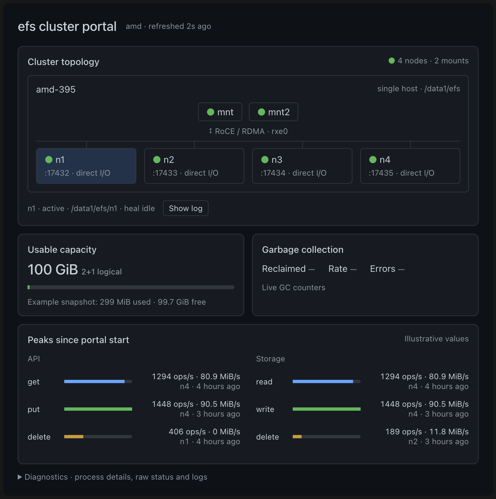

# efs

A distributed filesystem written in C, with a Linux FUSE client, Raft
metadata and erasure-coded storage. **Pre-alpha:** use disposable data while
correctness, recovery and product features are still being completed.

The latest tagged checkpoint is **[v0.2.0-pre-alpha](https://github.com/mit-orcd/efs/tree/v0.2.0-pre-alpha)**.
It adds RoCE support alongside native InfiniBand RDMA and retains TCP.
The AMD four-node test cluster passed the full POSIX, two-client and cold
remount suites with direct and buffered storage I/O over both TCP and RDMA.
[Release evidence and limits](docs/status/v020-amd-release.md).

## What is implemented

- File data uses 128 KiB chunks and a fixed **2 data + 1 XOR parity** stripe
  across three distinct storage nodes. Two available valid fragments can
  reconstruct a chunk.
- Metadata uses **two physical Raft groups** over an ordered on-disk KV.
  The current runtime supports three or four server nodes; many-group
  metadata leadership remains roadmap work.
- Linux clients mount through FUSE. Data transport supports TCP, native
  InfiniBand RDMA and Ethernet/RoCE RDMA.
- Servers support multiple storage roots, per-node quotas, asynchronous
  fragment garbage collection, and buffered or direct fragment I/O.
- Client writeback has bounded body admission, recovery capacity and a
  controlled drain/unmount operation.
- `efs-bench` provides engine and RPC benchmarks; profiling is kept separate
  from the daemon's serving role.

The [architecture](docs/how-it-works/architecture.md) describes the accepted
design. The [implementation review](docs/status/spec-implementation.md) and
[active queue](docs/status/README.md) distinguish shipped paths, staged work
and remaining acceptance gates. D25 publication remains staged.

## Requirements and build

Linux with a C compiler, `make`, `pkg-config`, Python 3.9 or newer, and the
system development libraries for **libfuse3 ≥ 3.12** and **libibverbs**.
BLAKE3 is vendored. The current Makefile links libibverbs even for TCP-only
use; an active RDMA device is needed only to use RDMA. FUSE mounts need a
usable `/dev/fuse`, `fusermount3` and permission to mount at the selected path.
The process-control wrappers require Linux pidfd support.

```bash
make             # binaries and compiled test targets; build on the target machine
make test        # unit/model suites and documentation checks
make docs-check  # generated architecture documents and internal references
```

Builds use `-O3 -g -march=native`. Compile on the machine class that will run
the binaries. Native CPU instructions can make a binary built elsewhere
incompatible. NFS-specific deployment rules belong to their cluster runbook,
not to every installation.

| Binary | Role |
| --- | --- |
| `efsd` | Storage and metadata daemon |
| `efs-fuse` | Linux FUSE client |
| `efs-mgmt` | Cluster status, initialization and metadata administration |
| `efs-query` | Legacy query tool; placeholder results remain [W80](docs/backlog/work-items.md#w80) |
| `efs-bench` | Local engine/prototype benchmarks and cluster RPC benchmarks |

## Start a disposable cluster

Follow the [three-node quick start](docs/using/quickstart.md) for explicit
node IDs, metadata voter count, initialization, mounting and shutdown.
Use [power-user settings](docs/using/power-user.md) for quotas, cache budgets
and management commands.

Transport and storage mode are independent:

- `EFS_TRANSPORT=tcp` selects TCP. `rdma` requires a successful RDMA upgrade;
  `auto` attempts RDMA when a suitable device is available and permits fallback.
- Native InfiniBand needs an active port/LID. RoCE needs an active Ethernet
  verbs device and a usable GID; `EFS_RDMA_DEV` and `EFS_RDMA_GID_INDEX` select
  them. See [transport setup](docs/using/power-user.md#mounting-and-transport).
- `efsd --direct-io` uses `O_DIRECT` for fragments; `--no-direct-io` uses the
  OS page cache and is the daemon default. This is independent of an
  application's `O_DIRECT` flag and the benchmark-only `--sync` option.

Upgrade all participating daemons and clients together: the build-ID handshake
rejects incompatible builds. Preserve existing stores and verify compatibility
before a migration; `mkfs` initializes an export and is not a format converter.

## Operator portal preview



**The portal is maintained separately and is not yet included in this repository.**
This picture illustrates the external operator interface, with example values;
it is not a benchmark or a live health report. Its four nodes run on one AMD
host, and `rxe0` supplies software RoCE rather than hardware RDMA offload.
A “heal idle” badge does not establish automatic fragment repair.

## Test acceptance

The v0.2.0-pre-alpha AMD runs used four daemons and two FUSE mounts on one
physical host. Each configuration passed:

| Fragment I/O | Transport | POSIX | Two-client | Cold remount verification |
| --- | --- | --- | --- | --- |
| Direct | RXE RDMA | 216 pass, 1 skip | 64/64 | 26/26 |
| Direct | TCP | 216 pass, 1 skip | 64/64 | 26/26 |
| Buffered | RXE RDMA | 216 pass, 1 skip | 64/64 | 26/26 |
| Buffered | TCP | 216 pass, 1 skip | 64/64 | 26/26 |

There were zero failures; the skip is unsupported writable `mmap`. Each cold
verification followed 26 successful prepare cases and a clean client remount.
Full Linux `make test` also passed. [Logs, process proofs and source/binary
hashes](results/measure/20261008-v020-amd/README.md) record the tested source.
These gates establish the recorded functional behavior, not hardware
power-loss durability, cross-host RoCE performance or native-IB acceptance of
this release. Historical throughput measurements are in
[performance.md](docs/how-it-works/performance.md).

See [testing and profiling](docs/how-it-works/testing.md) for local suites,
cluster-specific drivers, fault tests and measurement rules. Test totals evolve;
the current suite and retained result files determine the expected inventory.

## Writeback and safe shutdown

A returned buffered write can still belong to client memory. Use application
flush/close semantics and inspect errors; outstanding persistence and
synchronous-write gaps are recorded in [W71/W73](docs/status/spec-implementation.md).
Cold remount success alone does not prove survival of hardware power loss.

```bash
./scripts/client.sh stop /absolute/mount/path
```

Normal stop quiesces mutations and attempts a bounded drain before detaching.
If it refuses, keep the servers available and resolve the pending failure.
`stop --force-discard /absolute/mount/path` explicitly accepts loss of unresolved
writes. External unmount, signals and client death bypass the controlled-stop
contract. Stop every client successfully before stopping storage daemons.
[Operations](docs/operations/operations.md#scripts) describes process identity
checks and graceful server retirement.

## Remaining product work

Automatic reconstruction of lost fragments, protection-debt reporting and
configurable protection profiles remain open. A chunk with only two surviving
fragments is not repaired automatically. Metadata quorum is also required for
authoritative operations; fragment availability alone is not filesystem availability.
The legacy quota-degraded write path must not be described as an enforced
all-fragment durable-ACK guarantee.

Target persistence barriers, mount-wide session fencing, full integrity
coverage, authentication and fsck remain work in progress. Read the
[capability inventory](docs/backlog/product-gaps.md),
[public-path limitations](docs/status/spec-implementation.md), and
[current queue](docs/status/README.md) before relying on a design guarantee.

## Documentation and branches

- [Documentation index](docs/README.md): setup, operation, design and testing.
- [Architecture](docs/how-it-works/architecture.md): accepted protocols and invariants.
- [Current status](docs/status/README.md): implementation and remaining gates.
- [Operations](docs/operations/operations.md): storage, quotas, shutdown and management.
- [Historical records](docs/archive/README.md): dated investigations and acceptance.

Versioned tags identify tested checkpoints. Development continues on `devel`;
promotion to `main` is a separate step. Merging the branches does not delete
`devel`. This documentation refresh follows the v0.2.0-pre-alpha tag.

MIT. See [LICENSE](LICENSE).
